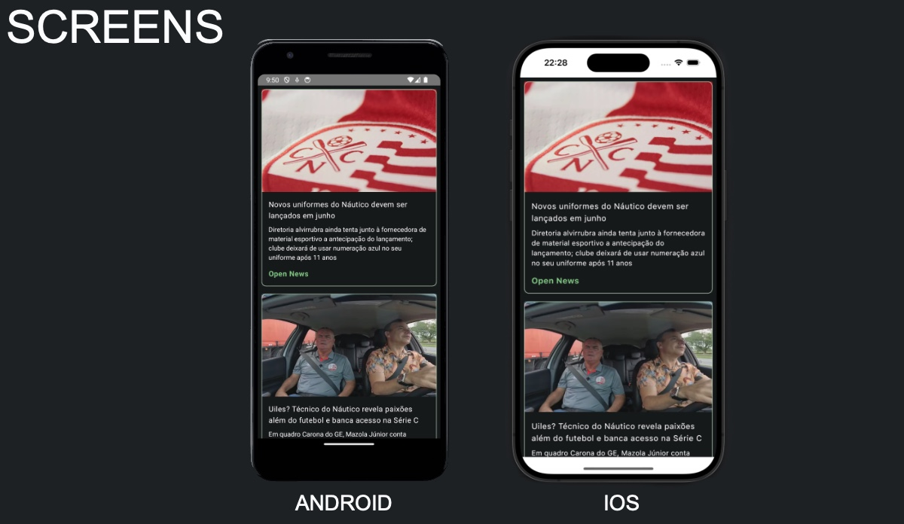

# App  Nautico News

This weekend I finished my first KMP project after a few weeks of studies. This app is Kotlin Multiplatform project targeting Android, iOS. 
I simulate an API behavior by a github pages who is concumed by app using ktor. For dependecie injections use koin and for. The UI I used Compose KMP.  

### Tecnologias & Tools

* Kotlin KMP
* Ktor
* Kotlin Coroutines
* Jetpack Compose KMP

### Status: Completed

Learn more about [Kotlin Multiplatform](https://www.jetbrains.com/help/kotlin-multiplatform-dev/get-started.html)…